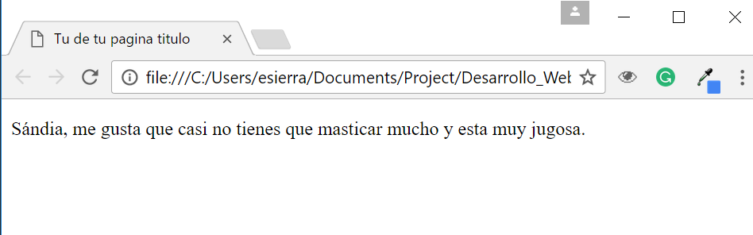
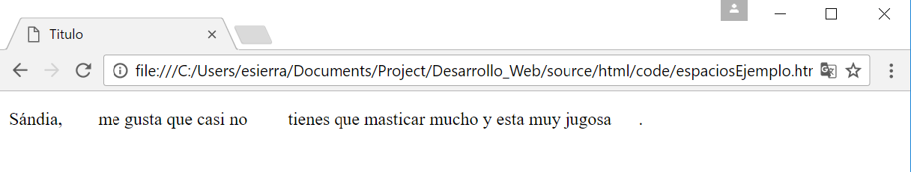
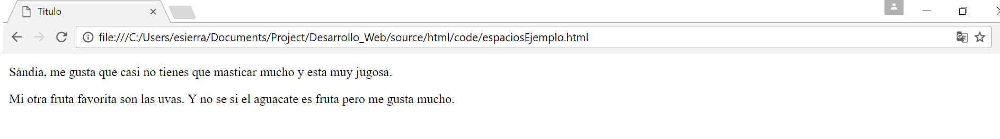
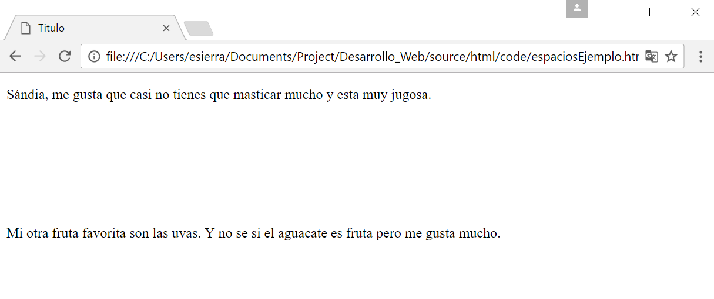

Caracteres especiales
=====================

Antes de empezar con esta lección me gustaria que hicieras algo que te ayudara 
durante el curso. Quiero que abras un nuevo archivo en *Brackets* y pongas este codigo.

.. code-block:: html
	:linenos:

	<!DOCTYPE html>
	<html lang="es">
		<head>
			<title>Titulo</title>
		</head>
		<body>
		</body>
	</html>

Guardalo como ``_base.html``. Cada vez que quieras empezar una nueva página vas 
a abrir ese archivo y vas a editar ese archivo.

Espacio en blanco
+++++++++++++++++
Quiero que crees un parrafo que diga tu fruta favorita y porque te gusta. El mio se veria asi:

.. code-block:: html
	:linenos:

	<!DOCTYPE html>
	<html lang="es">
		<head>
			<title>Titulo</title>
		</head>
		<body>
			
 Sándia, me gusta que casi no tienes que masticar mucho y esta muy jugosa. 

		</body>
	</html>

Y prueba tu página para ver como se veria en el navegador. Deberias de ver algo asi:

Ahora cambia tu parrafo y ponle demasiados espacios, asi:

``
Sándia, me gusta          que casi no tienes que``
``masticar     mucho y           esta muy     jugosa. 
``

Cual es tu resultado?! Se ve algo asi?

La razón es porque tu navegador no lee los espacios en blanco, puedes poner uno porque necesitas un espacio para separar las letras pero eso es todo. Si pones 100 espacios en blanco, *Google Chrome* va a leer uno e ignorar los siguientes 99 espacios en blanco.

.. hint:: 
	Muy fácil te voy a dar el codigo para que tu lo puedas hacer. Para poder poner espacios en blanco como este ``Hola         como estas?`` es ``&nbsp``.

.. code-block:: html
	:linenos:

	<!DOCTYPE html>
	<html lang="es">
		<head>
			<title>Titulo</title>
		</head>
		<body>
			
 Sándia, &nbsp&nbsp&nbsp&nbsp&nbsp&nbsp&nbspme gusta que casi no
			&nbsp&nbsp&nbsp&nbsp&nbsp&nbsp&nbsp&nbsptienes que masticar mucho y esta muy
			jugosa&nbsp&nbsp&nbsp&nbsp&nbsp&nbsp. 

		</body>
	</html>

	Se ve un poco ridiculo pero el resultado se veria algo asi:

Lineas en blanco
++++++++++++++++

Otro ejemplo seria, en tu documento crea dos oraciones con espacio entre cada una asi:

.. code-block:: html
	:linenos:

	<!DOCTYPE html>
	<html lang="es">
		<head>
			<title>Titulo</title>
		</head>
		<body>
			
 Sándia, me gusta que casi no tienes que masticar mucho y esta muy jugosa. 

			
Mi otra fruta favorita son las uvas. Y no se si el aguacate es fruta pero me gusta mucho.

		</body>
	</html>

No aparecen los espacios en blanco que dejamos entre las dor oraciones, pero porque?! Porque esa es la magia de Disney! No te creas, porque tu navegador ignora eso espacios. Y te has de preguntar pero si en alguna rara ocacion yo necesito esos espacios como puedo crearlos?

.. hint:: 
	Para que puedas poner lineas en blanco es aun más fácil de recordar es `` `` y significa break. Osea dale un break a Chrome parfavaar!

Se veria algo asi:

.. code-block:: html
	:linenos:

	<!DOCTYPE html>
	<html lang="es">
		<head>
			<title>Titulo</title>
		</head>
		<body>
			
 Sándia, me gusta que casi no tienes que masticar mucho y esta muy jugosa. 

			 
			 
			 
			 
			 
			 
			
Mi otra fruta favorita son las uvas. Y no se si el aguacate es 
			fruta pero me gusta mucho.

		</body>
	</html>

Taraaan!

Lista de Carácteres especiales
++++++++++++++++++++++++++++++

Así como el espacio en blanco existen muchos mas caracteres especiales que necesitan un codigo especial para que puedan aparecer en html. A continuacion te voy a dar una corta lista de otros caracteres que necesitan un codigo especial para aparecer.

+-----------+-----------------------------------+---------+---------+
| Resutaldo | Descripción                       | Nombre  | Numero  |
+===========+===================================+=========+=========+
| <         | menor que                         | &lt;	  | &#60;   |
+-----------+-----------------------------------+---------+---------+
| >         | mayor que                         | &gt;	  | &#62;   |
+-----------+-----------------------------------+---------+---------+
| &         | signo &                           | &amp;	  | &#38;   |
+-----------+-----------------------------------+---------+---------+
| "         | doble comillas                    | &quot;  | &#34;   |
+-----------+-----------------------------------+---------+---------+
| '         | comilla simple o apostrofe        | &apos;  | &#39;   |
+-----------+-----------------------------------+---------+---------+
| ¢         | centavo                           | &cent;  | &#162;  |
+-----------+-----------------------------------+---------+---------+
| £         | libra                             | &pound; | &#163;  |
+-----------+-----------------------------------+---------+---------+
| ¥         | yen                               | &yen;	  | &#165;  |
+-----------+-----------------------------------+---------+---------+
| €         | euro                              | &euro;  | &#8364; |
+-----------+-----------------------------------+---------+---------+
| ©         | copyright                         | &copy;  | &#169;  |
+-----------+-----------------------------------+---------+---------+
| ®         | marca registrada                  | &reg;	  | &#174;  |
+-----------+-----------------------------------+---------+---------+

Un lugar donde pueden encontrar mas de estos symboloes especiales es aqui: `W3Schools`

.. _W3Schools: https://www.w3schools.com/html/html_symbols.asp