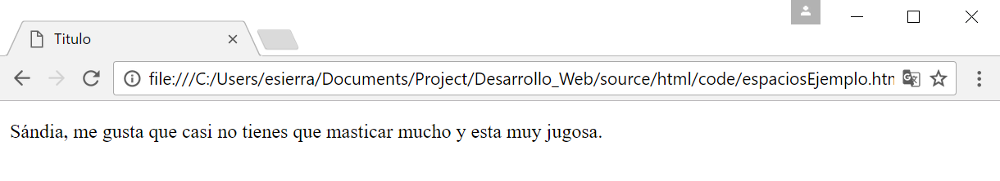

Comentarios
===========
Los comentarios son para tí, los comentarios no se muestran por el navegador pero sí en tu código, el propósito es ayudar a registrar y organizar tu código. Támbien te pueden ayudar a hacer notificaciones y recordatorios.

.. hint::
	Para crear un comentario tambien necesitas una etiqueta para empezar un comentario y una etiqueta para cerrar el comentario. ``<!-- Ejemplo de comentario -->`` 

.. code-block:: html
	:linenos:

	<!DOCTYPE html>
	<html lang="es">
		<head>
			<!--Este es un comentario-->
			<title>Titulo</title>
		</head>
		<body>
			<!-- Este es otro comentario.
			Puedes tenerlos en diferentes lineas.
			Solo necesitan estar dentro de las etiquetas-->

			
 Sándia, me gusta que casi no tienes que masticar mucho y esta muy
			jugosa. 

		</body>
	</html>

Nuestra página no muestra los comentarios como podemos ver a continuación.

.. tip:: 
	Otro consejo que yo te daria es que usaras los comentarios para documentar y hacer más fácil de leer tu codigo. Eso es muy buena práctica.
	