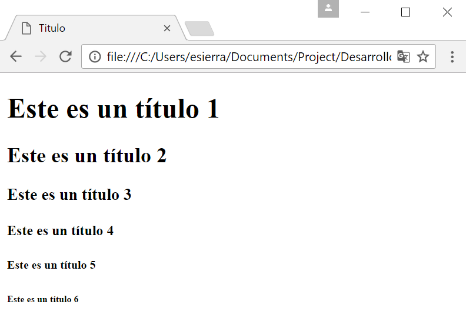

Encabezados
===========
Simple, existen diferentes tamaños de encabezados. Y se usarian para diferentes 
tipos de ocasiones. Definen desde los encabezados mas importantes ``<h1></h1>`` 
hasta los encabezados menos importantes ``<h6></h6>``

.. code-block:: html
	:linenos:

	<!DOCTYPE html>
	<html lang="es">
		<head>
			<title>Titulo</title>
		</head>
		<body>

		<h1>Este es un encabezados 1</h1>
		<h2>Este es un encabezados 2</h2>
		<h3>Este es un encabezados 3</h3>
		<h4>Este es un encabezados 4</h4>
		<h5>Este es un encabezados 5</h5>
		<h6>Este es un encabezados 6</h6>
		</body>
	</html>

.. important:: 
	Los encabezados son importantes. Los motores de búsqueda utilizan los 
	encabezados para indexar la estructura y el contenido de tu páginas web.

Los usuarios navegan por tu página por sus encabezados. Es importante utilizar 
encabezados para mostrar la estructura de tu documento.

Los encabezados ``<h1>`` deben usarse para los encabezados principales, seguidos 
por encabezados ``<h2>``, luego los ``<h3>`` menos importantes, etc.

.. note:: 
	Utiliza los encabezados sólo para encabezados. No utilice encabezados para 
	hacer texto GRANDE o en **negrita**.