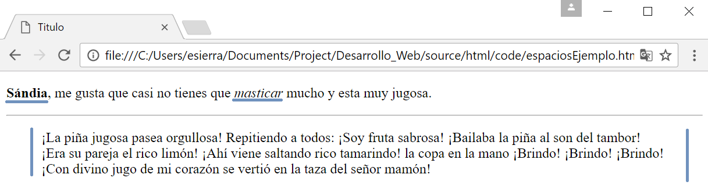

Etiquetas para texto
====================
Como puedes imaginarte el texto se puede editar de diferentes maneras tenemos **bold** y *italics* por ejemplo y estoy casi seguro que has usado ese tipo de texto en Word. Esto es simple:

.. code-block:: html
	:linenos:

	<!DOCTYPE html>
	<html lang="es">
		<head>
			<title>Titulo</title>
		</head>
		<body>
			<!-- La etiqueta <strong></strong> va a volver el texto que esta entre las etiquetas en negritas-->
			<!--La etiqueta <i> </i> volvera el texto en italica-->
			
 <strong>Sándia</strong>, me gusta que casi no tienes que <i>masticar</i> mucho y esta muy
			jugosa. 

			<!-- Una simple linea-->
			

			<!--Alerta nuevo elemento! <blockquotes> </blockquotes> es un elemento que se usa para citar cosas. -->
			<blockquote>
				¡La piña jugosa pasea orgullosa!
				Repitiendo a todos:
				¡Soy fruta sabrosa!
				¡Bailaba la piña al son del tambor!
				¡Era su pareja el rico limón!
				¡Ahí viene saltando rico tamarindo!
				la copa en la mano
				¡Brindo! ¡Brindo! ¡Brindo!
				¡Con divino jugo de mi corazón
				se vertió en la taza del señor mamón!
			</blockquote>
		</body>
	</html>

Otra etiqueta que te ayuda a hacer tu texo mas *cool* es ``
`` y esta etiqueta no necesitas cerrarla.