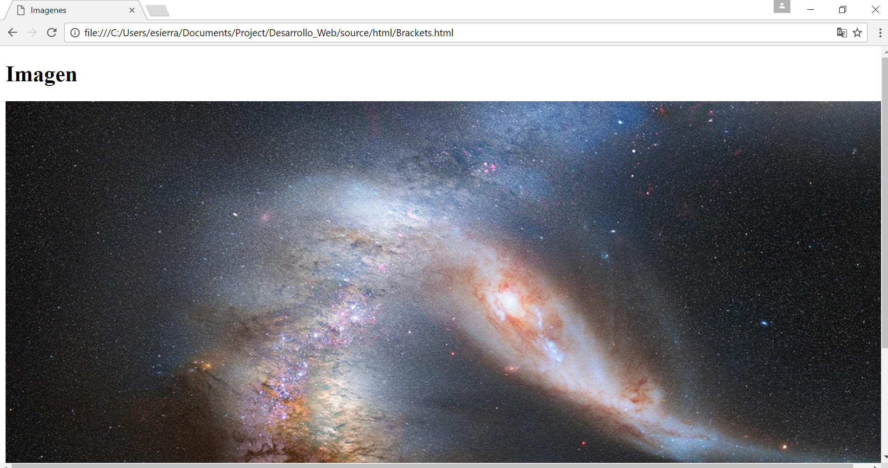
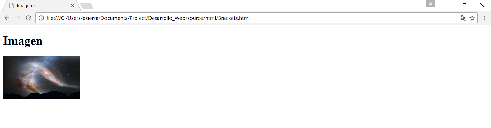

Imágenes
========
En HTML, las imágenes se definen con la etiqueta ```` que está vacía, contiene sólo atributos y no tiene una etiqueta de cierre. El atributo *src* especifica la URL (dirección web) de la imagen:
````. Y las clases de ingles se las dejo gratis!

En el siguiente ejemplo declaro un elemento de tipo *img* ```` en nuestro documento *HTML*

.. code-block:: html
	:linenos:

	<!DOCTYPE html>
	<html lang="es">
		<head>
			<title> Imagenes </title>
		</head>
		<body>
			<h1> Imagen </h1>
			
		</body>
	</html>

Resultado:



Directorios
-----------

.. code-block:: html
	:emphasize-lines: 3

	<body>
		<h1> Imagen </h1>
		
	</body>
.. danger::
	Y que significa el url o ``img/el_universo``

Como pueden ver en el ejemplo, la imagen es demasiado grande. Vamos a hacerla más chica.Intentalo, declara un atributo en el elemento ```` de tipo width y dale 200 de valor.
Lanzamos la página. Y obtenemos este resultado:


