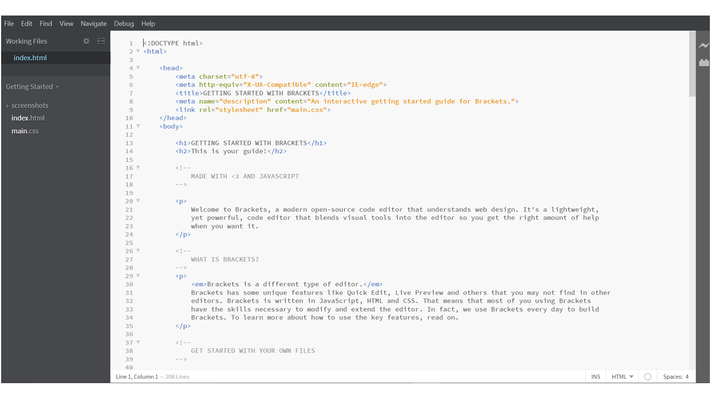
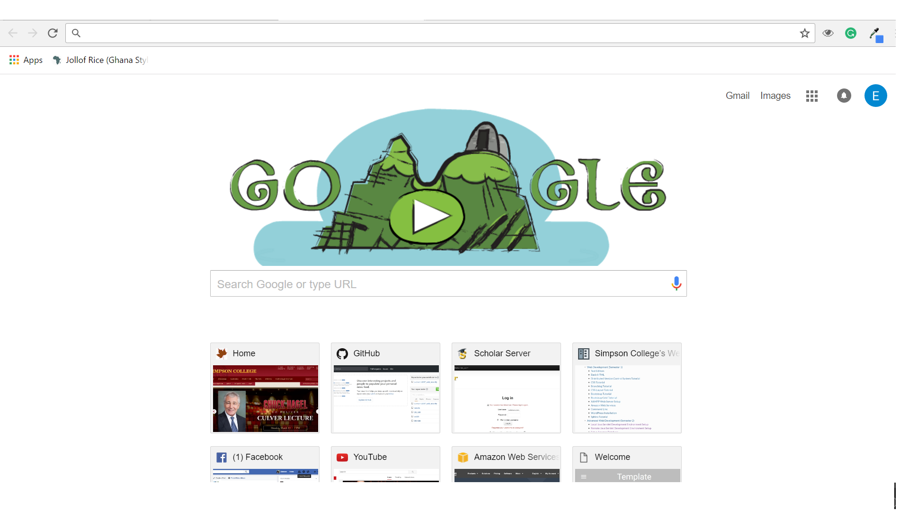

.. Desarrollo Web documentation master file, created by
   sphinx-quickstart on Sun Mar 12 16:06:12 2017.
   You can adapt this file completely to your liking, but it should at least
   contain the root `toctree` directive. 
.. toctree::
   :maxdepth: 2
   :caption: 

   
   Leccion1/leccion1

Introducción
==========
Felicidades! Has dado el primer paso a para empezar a Desarrollar y Diseñar Páginas Web. La persona promedio navega el internet por un promedio de 1,404 horas cada año y existen un total de 1 billón de páginas web creadas. Es tiempo de que entendamos que tiene a este mundo tan perplejo. Me da gusto que encuentres mi curso en línea interesante y te aseguro que lo es.

Mi nombre es Esteban Sierra y tengo dos carreras una en ciencias computacionales e informática y tengo 4 años creando páginas web. Sabemos que las computadoras y el internet son lo de hoy. Entonces dejame mostrarte lo fácil que es crear tu propia página de internet, que podrias llegar a utilizar para lo que tu quieras. Tu limite sera tu creativida asi que ponte trucha, no te vas a arrepentir.

Requisitos
-----------
* Una computadora con acceso a internet.
* Profavor descarga e instala:
	1. `Brackets  <http://brackets.io/>`_  .  Un moderno editor de texto que hace que sea fácil diseñar páginas web.
	2. `GoogleChrome <https://www.google.com/chrome/browser/features.html?brand=CHBD&gclid=CjwKEAjwkq7GBRDun9iu2JjyhmsSJADHCD_Hwthi0hOt-0a9Ah0tTukTtp9vLeLwcy4PI6YZ3gmgpBoCV3vw_wcB>`_ es un simple, rapido y seguro navegador web, hecho para la web moderna.
* **No** **necesitas** tener **experiencia** previa, vamos a empezar juntos desde cero y vamos a llegar a tener el conocimiento y la práctica de como crear paginas web.

Nuestra Meta
------------
Vamos a comprender en su totalidad el ambito de diseñar páginas web. Existen tres terminos  para clasificar el tipo de desarrollo web *Front End*, *Back End* y *Full Stack*. Relax, no tienes que aprenderte los terminos pero me gustaria que los entendieras. Y cada termino tiene sus propios lenguajes, metodos y herramientas de desarrollo. Nosotros aprenderemos *Front End*

Front End
^^^^^^^^^
==========	==============================
Lenguajes	Herrmanietas
==========	==============================
HTML 5		Editor de texto: *Brackets*
CSS 6		Navegador Web: *Google Chrome*
Javascript
==========	==============================

Habiendo dicho esto me gustaria explicarte un poco el modo de aprendizaje que estare ofreciendo. Este curso se basa en enseñarte terminos y maneras, ponerlos en practica y ahí mismo ver los resultados. Pero pronto entenderas porque mi curso es tan especial.

Quibole Que?!
-------------
Asegurate que una vez que hayas descargado Brackets y Google Chrome se vean algo asi:

Brackets
^^^^^^^^

Google Chrome
^^^^^^^^^^^^^

.. Indice
..======

..* :ref:`genindex`
..* :ref:`modindex`
..* :ref:`search`
