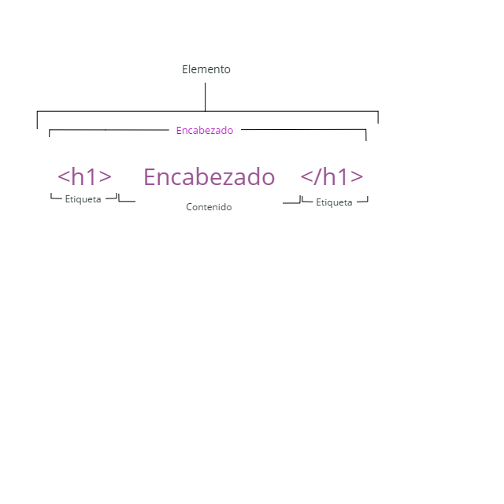
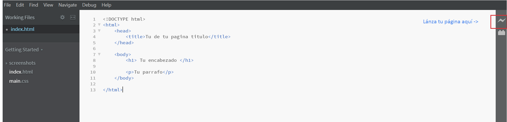
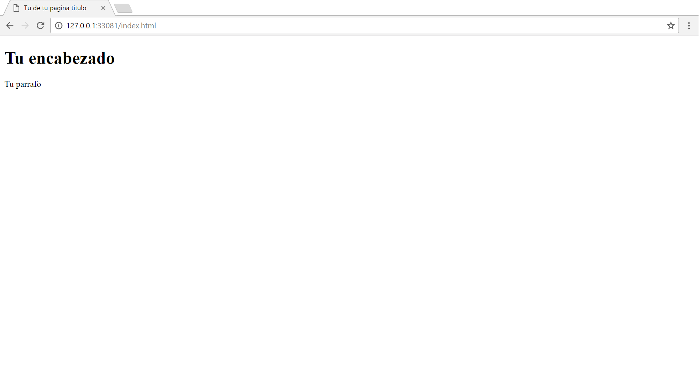

Lección 1
=========

HTML
----

HTML
	**HyperText Markup Language** proporciona una forma lógica de estructurar contenido para páginas web.

.. Es el idioma utilizado para crear las páginas web que visita todos los días.
Un lenguaje de marcado es un lenguaje informático que define la estructura y presentación de los textos.

* Los elementos de HTML son los bloques de construcción de las páginas HTML.
* Los elementos de HTML son con etiquetas.
* Las etiquetas de HTML etiquetan partes de contenido como "encabezado", "párrafo", "tabla", etc.
* Los navegadores no muestran las etiquetas HTML, pero las utilizan para procesar el contenido de la página

.. important:: 

	Cada vez que abres una etiqueta, asegurate de **SIEMPRE** cerrarla como acontinuación. 
	``<h1> </h1>``

Y con un conjunto de bloques construimos lo que es una pagina web. A continuación te voy a dar un ejemplo de la base de un archivo html. 

.. literalinclude:: example1.html
   :language: html
   :linenos:
   :caption: example1.html

Cuando abras por primera vez *Brackets* aparecera un archivo con texto ya escrito. Elimina todo, cópia y pega el ejemplo de *html5* que vez aquí. Lánza tu página en Google Chrome así:

Google Chrome debería abrirse con una página que luce algo así:

.. hint::

	Deja saber a tu  navegador web que estás utilizando el lenguaje HTML     *<!Doctype html>. Esta etiqueta no tienes que cerrarla.

HyperText es el texto que se muestra en una computadora o dispositivo que proporciona acceso a otro texto a través de enlaces, también conocidos como "hipervínculos". De hecho, es probable que haya hecho clic en muchos, muchos hipervínculos en su camino a este curso Codecademy!

.. raw:: html
	
	

	
En este curso, aprenderá a utilizar los fundamentos de HTML para estructurar, presentar y vincular contenido. También aprenderá a usar CSS o Cascading Style Sheets para diseñar el contenido HTML que agregue a las páginas web.

¡Empecemos!